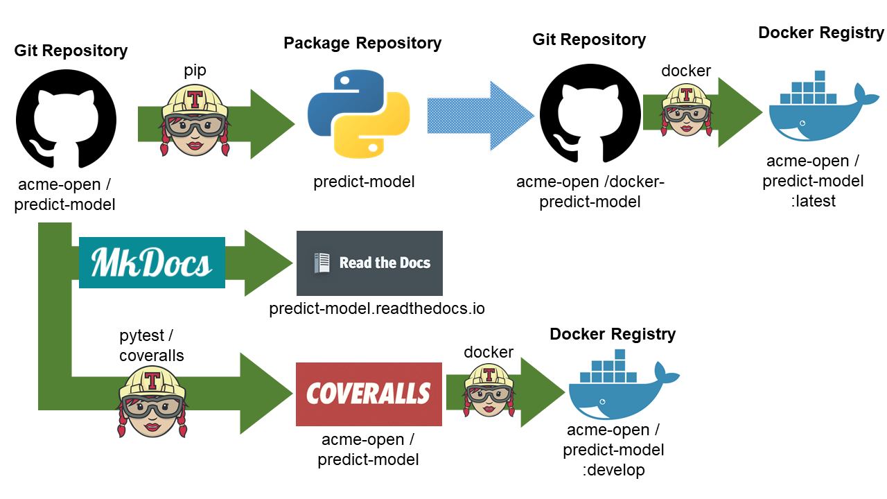

# Patterns_for_Continuous_Integration_Docker_Travis_CI_2_DEV

[](https://travis-ci.org/gtesei/Patterns_for_Continuous_Integration_Docker_Travis_CI_2_DEV)



__The “Docker repo” pattern__: _create two separate Git repositories: one for Docker release and another for software development. This keeps the Docker-specific code isolated from the actual software. Developers can continue working on the source software as usual, while the production Docker image is developed separately_

This repository is an example of the Git repository for software development. 


## Dockerfile 
 
```docker
FROM python:3.6

COPY . /myproject
WORKDIR /myproject
RUN pip install -e .

CMD ["myproject", "run"]
```

## .travis.yml  

```yml
language: python
cache: pip
matrix:
  include:
    matrix:
    - python: '2.7'
    - python: '3.5'
    - python: '3.6'
    - sudo: required
      services:
      - docker
      env:
      - IMAGE_NAME=gtesei/hello_docker_2
      - REGISTRY_USER=gtesei
      - secure: "H8o2BrmikY0e9Gzj1t/Ca1H+hblEv9GC6Qd9MQoN/zxXx0MtiZw3eyCuBO4rpYvX80oeS/e9QM1b4v8OUCsRqGd1nwz4QhRQIRyzh03+n+Sp84qnTqAZvDNbPl0WYDSJyRYFij7SpVP37encJX8ioPaE+YarNn1AGUAVthFOvWhEEeuDGV0lDOXw0j+LsXr1hf821dqvlFLBXPE0dVB6LZD2QEde4BaCQaM+FgBRrcz/bkLMBByviUxdCevJsHSOnhc4rZCbBZ5k5oByJsXVMX/S+SFwP5N4ljkF9rjtIA8fMOlGjk8Z8kXSk3BeLctXGSrZBZBsXG2e89AfBeXFrK91tYdLJROXWdd6MN+U9r+FSIblHqB51zE2zFUpXK9pijUeJLNC2eacdNMRTvxA+tudEIuGkIKkgA4aGw8knoroWXI8ByLtVJA2mXQvlMqiN+pVQt36rwx1Tz0mlw2QOsI713f/JhSoJQNX7flRJrcs2FroCCmDrnpXiE+FN+svjLKz7b07lzw8H78PGfj11YPV8LGDHMRqf0/fu55157QaDgoDKekBLuwXYGT+q5pOu91r+9ywIUo5V8WXel7VM1iUqu3Kjq8DLpwiTErENwEEoq8x5uATXAHsnoXEpBFSj6RsU1BdambMkoz7bbOgviVwTDTGB4jgX7iYdlEYdzA="
      before_install:
      - sudo apt-get update
      - sudo apt-get install -y -o Dpkg::Options::="--force-confold" docker-engine
      install: []
      before_script:
      - docker pull "${IMAGE_NAME}:develop" || true
      script:
      - docker build --pull --cache-from "${IMAGE_NAME}:develop" --tag "$IMAGE_NAME"
      before_deploy:
      - docker login -u "$REGISTRY_USER" -p "$REGISTRY_PASS"
      - git_sha="$(git rev-parse --short HEAD)"
      - docker tag "$IMAGE_NAME" "${IMAGE_NAME}:develop"
      - docker tag "$IMAGE_NAME" "${IMAGE_NAME}:${git_sha}-develop"
      deploy:
        provider: script
        script: docker push "${IMAGE_NAME}:develop" && docker push "${IMAGE_NAME}:${git_sha}-develop"
        on:
          branch: master
install: pip install -r requirements-dev.txt
script: pytest
deploy:
  provider: pypi
  user: gtesei
  password: 
    secure: "OAe6auQNcPDkhVecQZFcsGetZcYrT31C3YexFtCDx54vC8uW6s5GwSfSbCSJSusNRA3wq8a5K2PsPSjEs7t1DbaBP9NRFJuPyX4WCfGW4V091HaC2V8DCtjx/bsLXok3uHENXpPbsVEX55JM6VpT9Pnz2vF3gJPWy1JOZWEnjAw+DwP2edRbJJczaWNsRFKP9LGk7FIt+5nqiw8SVoJ9NzJjJzvgmBEbHDI7d/DW6YwjxVdE9Pvsgtl9d/sp5V025GwWwyT4ULgveZEx/B58MAs4ndR2yOorT1n/i1RFtE3PU24NGwpL43yS+0KyjEZMC/I8cO6hMtvSLJcFbzI6l4/TbG0B17p26pmVeejp8e+Pq24F0MVel7OzFAIWbHEhtWcSKIuFsGUnunxvNrf23eaSK+gm8Nenjpo94C9lEDF3u7bjtfSjIKS4DdBcGCE+lBEoxBWrVZElfv0j3NukyLrCQhLwnc2s4XrX/yrQ3BqK0fLIb0mE3eOd66Rc8PqDEq5KTWdp4PrR0UVVKqeS/1EccmZ4qkK6moSnhUNAwJD1xlotPNJpyj5mit1eea+XFUSwXdXSe39JFUtwYlHG/gVHSIXnMoL4eXJUK0o40BoYtKRQ3BvfRIYCBWoquLCEbKyOolbcH4WDSMd3h/ogY8E5EdyhXmnQZhmroYJOwYE="
  distributions: sdist bdist_wheel
  on:
    tags: true
```


## How to encrypt password of Docker Hub on .travis.yml 


```yml
sudo: required
services:
- docker
env:
  global:
  - REGISTRY_USER=gtesei
  - secret: "<something long>"
  - secure: W8cjk1MzKPXbs+u1PVlP1WPyKOKon0PEeVSf790tV6VtOlExRAK3NPEyFzZ3jjkTsenB/sspBawIJlqjPBQAqeeGz2I7vwWRj1UxawbmHaxaodoclMx3APbg8iW/+qH4bm0M2uyb9F6JWY8azD/j7GKIW8otyIb8s+9qu+wFR9HMuxFuvy8MPABgTk3r6/qflSwWd0QZkia3UqAauFAHCtxTZSwBWz0kL4XBgBEcArVU+1tu6rhOPWsm+CEcxf3WwjCYHdemp5MffC1hWvzgffVWuuFb7Y7ICCCVjaNQ8jgbtJ4HzoFW3vpocRJk7nJiWzTNwXbzqLfreApPEI5ADQqpBczJw23oDG42MiFTurdIXKghzgHo79tDG6ezGRWCkiutcWPu7mgYbWX6og966IboMAOh7aO4zBJY77xkDNYT1YWcrKF3P6Chk7roaGEUJGtZsz/osKzT+XSVdmgOKeQt2fawFlEd7DWAnoDrJwcOWq4NGobR46llQ8YJHHjObS5wzr/ktLvoURDNzTi3RjE4N3nQZvOu57GDcrQ7bkz4if+KNShnkvKg+4DAryB6sSvFaIAtkZmDN1Jf3EgO9eVAKmgGm3AVLzzKsI5NWVIbYqs4Ixp6tFeQ6WF5ad9oeyTVWlov7cDvQclgq0ineO7vgpS5VfqgJQZ6cb92kBg=
before_script:
- docker pull myorg/myimage || true
script:
- docker build --pull --cache-from gtesei/hello_travis --tag gtesei/hello_travis .
- docker run gtesei/hello_travis
after_script:
- docker images
before_deploy:
- docker login -u "$REGISTRY_USER" -p "$REGISTRY_PASS"
deploy:
  provider: script
  script: docker push gtesei/hello_travis
  on:
    branch: master
```

## For each commit on master branch Travis CI builds a new Docker image ...   


## ... and pushes it on Docker Hub (or different Docker Registry)


## Useful links  

[Ruby Installer for Windows](https://rubyinstaller.org/downloads/)

__To install Travis__ 
```ruby 
gem install travis
```
## Credits 

[Coding Tips: Patterns for Continuous Integration with Docker on Travis CI - Part 2 of 3: The “Docker repo” pattern](https://medium.com/mobileforgood/patterns-for-continuous-integration-with-docker-on-travis-ci-71857fff14c5)

[Defining encrypted variables in .travis.yml](https://docs.travis-ci.com/user/environment-variables/#defining-encrypted-variables-in-travisyml)

[Google Cloud | Continuous Delivery with Travis CI](https://cloud.google.com/solutions/continuous-delivery-with-travis-ci)

[Continuous Integration. CircleCI vs Travis CI vs Jenkins](https://hackernoon.com/continuous-integration-circleci-vs-travis-ci-vs-jenkins-41a1c2bd95f5)

[Continuous Integration with Jenkins and Docker](https://code-maze.com/ci-jenkins-docker/) 

