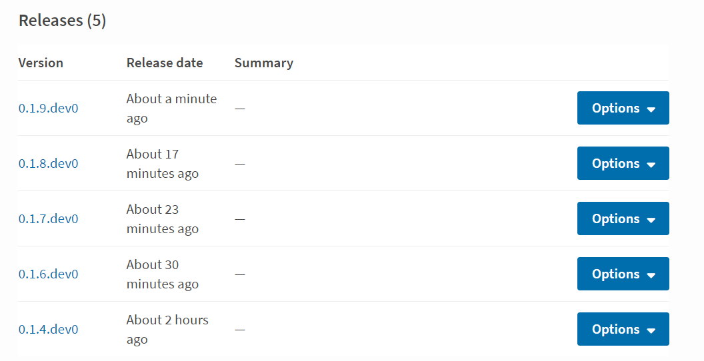
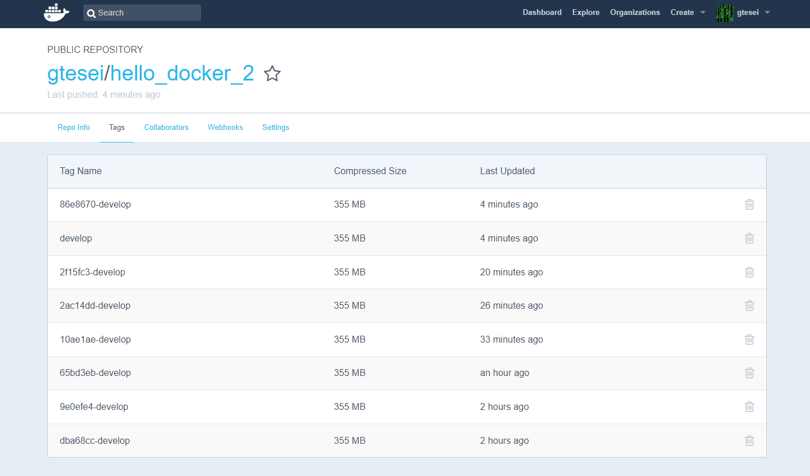

# Patterns_for_Continuous_Integration_Docker_Travis_CI_2_DEV

[](https://travis-ci.org/gtesei/Patterns_for_Continuous_Integration_Docker_Travis_CI_2_DEV)


__The “Docker repo” pattern__: _create two separate Git repositories: one for Docker release and another for software development. This keeps the Docker-specific code isolated from the actual software. Developers can continue working on the source software as usual, while the production Docker image is developed separately_

This repository is an example of the __Git repository for software development__. 

Specifically, we assume that the team uses some different branches and a certain point a pull-request for the master branch is necessary. After committing the master branch:
- before the commit, it is necessary modify the version number into _setup.py_ so that a new release will be created on the package repository ([PyPI](https://pypi.org/) in our case) 
- on Travis CI a new job is created __pytest__ tests are performed
- if tests are successful 
    - a new release will be created on the package repository ([PyPI](https://pypi.org/) in our case)
    - a two new docker development images will be released on the Docker Registry ([Docker Hub](https://hub.docker.com) in our case) 

## Dockerfile 
 
```docker
FROM python:3.6

COPY . /myproject
WORKDIR /myproject
RUN pip install -e .

CMD ["myproject", "run"]
```

## .travis.yml  

```yml
sudo: required 
services:
- docker
env:
  global:
    - IMAGE_NAME=gtesei/hello_docker_2
    - REGISTRY_USER=gtesei
    - secure: H8o2BrmikY0e9Gzj1t/Ca1H+hblEv9GC6Qd9MQoN/zxXx0MtiZw3eyCuBO4rpYvX80oeS/e9QM1b4v8OUCsRqGd1nwz4QhRQIRyzh03+n+Sp84qnTqAZvDNbPl0WYDSJyRYFij7SpVP37encJX8ioPaE+YarNn1AGUAVthFOvWhEEeuDGV0lDOXw0j+LsXr1hf821dqvlFLBXPE0dVB6LZD2QEde4BaCQaM+FgBRrcz/bkLMBByviUxdCevJsHSOnhc4rZCbBZ5k5oByJsXVMX/S+SFwP5N4ljkF9rjtIA8fMOlGjk8Z8kXSk3BeLctXGSrZBZBsXG2e89AfBeXFrK91tYdLJROXWdd6MN+U9r+FSIblHqB51zE2zFUpXK9pijUeJLNC2eacdNMRTvxA+tudEIuGkIKkgA4aGw8knoroWXI8ByLtVJA2mXQvlMqiN+pVQt36rwx1Tz0mlw2QOsI713f/JhSoJQNX7flRJrcs2FroCCmDrnpXiE+FN+svjLKz7b07lzw8H78PGfj11YPV8LGDHMRqf0/fu55157QaDgoDKekBLuwXYGT+q5pOu91r+9ywIUo5V8WXel7VM1iUqu3Kjq8DLpwiTErENwEEoq8x5uATXAHsnoXEpBFSj6RsU1BdambMkoz7bbOgviVwTDTGB4jgX7iYdlEYdzA=
language: python
python:
    - "3.6"
cache: pip
before_install:
    - sudo apt-get update
install: pip install -r requirements-dev.txt
script: pytest
deploy:
  provider: pypi
  user: gtesei
  distributions: sdist bdist_wheel
  password:
    secure: As9TKWe41QcMXIZ0lKZ7uYblvMbOrWklUjbtZo16juLvDmQDd2dqseEv+eBuI6ur6mov8P0+8MuyOcnDcmeUT0FXTYnjw2BHQC8diH4YvNfupRv6dJDspy3UfI8koQzTJqRfoz30UoCWKS4uU9RYP3uRU6VDIabmECAtKdi3eROeeb88W9LlWMXeuQPiNZlyWFQnHrekRWfzvuZtsxkj5eRtkfUsXTnChbBru0yulv9xIJPcigvvBE/I2DF6c1KFQbtXQ2h4a1FYJ9/NbbHthtvWWSvotJK0825mhiIiCjQwy+GmsiMf5ofnVs7Fe3E0bJLdX8npPBy1BGZnVN4vd+j74Vl/Dtziy5uqFe9bPgYZk3jOBcfnDWrpAdh1Qmt1D4ZBqD0afShSyyMi0N2+B+R58bMuWj3dzgc4zZp0NjCS/S8Qt6c9Q/bYF58hA9rGKGydoKcfmdC80SUPgbYa3UKnEJo+oxtuhZlNB7A+KqccQmfPHgq/Ra4BR3ImUokhW68GVqCB1378ynNAML4vdhTHWBVRnsG+gvk1slrRsH1yOqBQo5IWMkWO8SD2OGp56u7P96m9Oh1yXhPxfCFp/9K/5IWSJ3DsA+TjieUPJW7jbMamw/CQvIOpv+VEfkorh9Oxijf22qt88/dN5OZ6Az2IAxQwBZI7D9BISnibj/w=
  on:
    branch: master
after_deploy: 
  - docker pull "${IMAGE_NAME}:develop" || true
  - docker build --pull --cache-from "${IMAGE_NAME}:develop" --tag "$IMAGE_NAME" .
  - docker login -u "$REGISTRY_USER" -p "$REGISTRY_PASS"
  - git_sha="$(git rev-parse --short HEAD)"
  - docker tag "$IMAGE_NAME" "${IMAGE_NAME}:develop"
  - docker tag "$IMAGE_NAME" "${IMAGE_NAME}:${git_sha}-develop"
  - docker push "${IMAGE_NAME}:develop" && docker push "${IMAGE_NAME}:${git_sha}-develop"
```

## Package repository [PyPI]



## Docker Registry [Docker Hub]



## Useful links   

[Ruby Installer for Windows](https://rubyinstaller.org/downloads/)

__To install Travis__ 
```ruby 
gem install travis
```
## Credits 

[Coding Tips: Patterns for Continuous Integration with Docker on Travis CI - Part 2 of 3: The “Docker repo” pattern](https://medium.com/mobileforgood/patterns-for-continuous-integration-with-docker-on-travis-ci-71857fff14c5)

[Defining encrypted variables in .travis.yml](https://docs.travis-ci.com/user/environment-variables/#defining-encrypted-variables-in-travisyml)

[Google Cloud | Continuous Delivery with Travis CI](https://cloud.google.com/solutions/continuous-delivery-with-travis-ci)

[Continuous Integration. CircleCI vs Travis CI vs Jenkins](https://hackernoon.com/continuous-integration-circleci-vs-travis-ci-vs-jenkins-41a1c2bd95f5)

[Continuous Integration with Jenkins and Docker](https://code-maze.com/ci-jenkins-docker/) 

